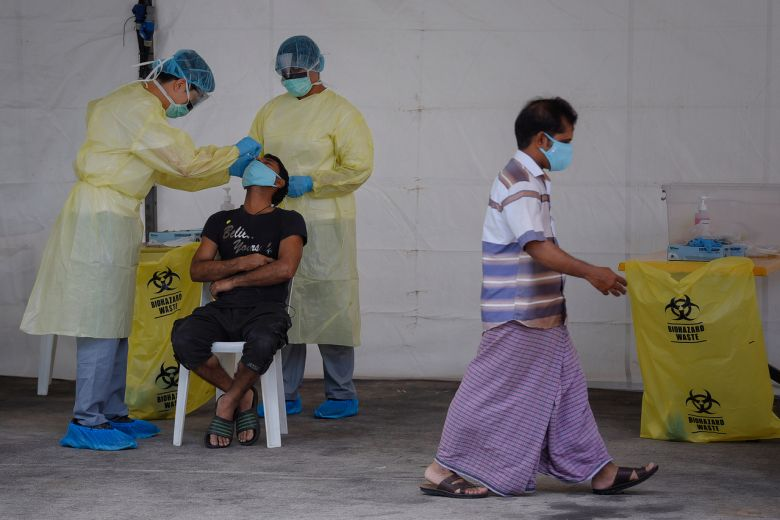

## Identifying and predicting sentiment and key topics of forum posts on the Singapore government's handling of the COVID-19 outbreak in foreign worker dormitories 

### Problem Statement

Singapore is in the midst of battling the COVID-19 pandemic. As of 6 Aug 20, there were 54,555 cases, 51,633 of which belong to foreign workers residing in dormitories. These cases make up almost 95% of the total number of COVID-19 infections in Singapore. The first cluster in a foreign worker was dorm on 1 Apr 20. Since then, the government has started testing all workers, isolating infected people and restricting their movement beyond the dorms to reduce the risk of a community spread, which would be difficult to contain due to the sheer number of potential infections amongst workers living in dorms. Notwithstanding its efforts, the government has received criticism for not acting swiftly enough to curb the spread of COVID-19 in the dorms since the first case of an infected foreign worker was reported on 9 Feb 20, nearly two months prior to the detection of the first cluster in April. Netizens have expressed their opinions on the government’s handling of the issue on forums, and I believe that these posts could contain important feedback on the people’s sentiment and key concerns 

The project has two parts, sentiment analysis and prediction, as well as topic modeling. A variety of unsupervised and supervised learning models and neural networks were used before optimal production models were found. The models were evaluated based on their accuracy, F1, and ROC AUC scores due to an inbalanced class issue, as well as coherence scores for topic modeling 

### Executive Summary

The data was obtained by scraping forum posts on this topic from Hardware Zone, Reddit and SG Talk. A total of 10275 posts were scraped, 6085 from Hardware Zone, 3494 from Reddit and 727 from SG Talk.  

#### Sentiment analysis and prediction
The posts were then cleaned and preprocessed. 20% of the posts were set aside as the test set. Of the remaining 80%, a sample of 1000 posts were manually labelled to serve as a training set to label the remaining posts in the test set. A variety of models were used to label the data. Naïve Bayes and Logistic Regression Machine Learning models, Recurrent Neutal Networks, as well as pretrained libraries such as Textblob and VADER. The Naïve Bayes model was found to have worked best and so it was used to incrementally predict the sentiment of posts in the train set. Each set of predictions was followed up with a manual check. 

The Naïve Bayes model also worked best for predicting sentiment in the test set, based on the metrics of accuracy and ROC AUC scores, and was chosen for the final production model. Other models considered were a Logistic Regression model, Long Short Term Memory Recurrent Neural Network and a pretrained BERT model. ROC AUC score was used as the sentiments for the posts were extremely unbalanced. 10% of the posts were negative (class 0), 85% of the posts were neutral (class 1) and 5% of the posts were positive (class 2). The ROC AUC score expressed how well the model was able to separate the classes. 

***Note: Methods such as SMOTE, random oversampling and manipulating class weights were used to try to address the issue of unbalanced classes in the data, all of which did not perform as well as a model where the minority classes were not oversampled/given more weightage in the model.***

A deployment model based on the Multinomial NB model was deployed on Heroku. It is able to predict the sentiment of unseen forum posts on this topic. (https://forum-sentiment-topic-analysis.herokuapp.com)

#### Topic modeling 
After the sentiment of all posts were labelled, topic modeling was conducted for the negative and positive class posts to find out the key topics of both groups of posts. The Latent Dirichlet Allocation model with MALLET was used to identify the key topics. While coherence scores were a key consideration of which model to choose, the actual coherence and separation of topics were the key success metric when considering the best LDA model. 

### Contents
- [1. Scraping forum posts](./1_scraping_data)
- [2. Data cleaning and EDA](./2_data_clean_eda)
- [3. Labeling sentiment of forum posts](./3_sentiment_labeling)
- [4. Sentiment analysis](./4_sentiment_analysis)
- [5. Topic modeling](./5_topic_modeling)
- [6. Deployment model ](./6_deployment_model_predict_sentiment)

### Data dictionary for modeling notebooks (Folder 4 onwards)
|Feature|Type|Description|
|---|---|---|
|post|obj|Original post scraped from forum|
|label|int|Sentiment label: Negative (class 0), Neutral (class 1), Positive (class 2) |
|date|datetime|Date of post| 
|source|obj|Source of post|
|post_clean_nb_logreg|obj|Preprocessed post for Multinomial NB and Log Reg modeling for sentiment analysis|
|post_clean_rnn|obj|Preprocessed post for RNN modeling for sentiment analysis| 
|post_clean_lda|obj|Preprocessed post for LDA topic modeling| 

### Key findings from the sentiment analysis model
For sentiment analysis and prediction, the Multinomial Naive Bayes model was the most accurate in predicting sentiment. It had high Accuracy (0.866), ROC AUC (0.726) and F1 scores (0.873), with little variance between the train and validation sets, as well as being more likely to assign minority classes. 

Top words indicating positive or negative sentiment posts had many similarities. However, for negative sentiment posts, the exceptions were calling out organisations and agencies in their posts - 'PAP' (People's Action Party - the ruling party) and 'MOM' (Ministry of Manpower). The word 'still' indicates a sentiment in these posts that COVID-19 cases in dorms remain high. 'Mask' is also another word in negative sentiment posts - perhaps taking issue with the Governmealsnt's delay in asking people to wear masks in public. For positive sentiment posts, words like 'people', 'government', 'singapore' are top words indicating positive sentiment - similar to negative sentiment coefficients but of more importance. 'Would', 'should' - indicating some kind of suggestion in the post which may be revealed during topic modeling. 

### Key findings from topic modeling 
The best model for topic modeling was the LDA model with MAchine Learning for LanguagE Toolkit (MALLET) implementation. The optimal number of topics was found to be between 5 and 10, based on a line chart of nunber of topics vs. coherence score. The LDA with MALLET performed better than the vanilla LDA model at topic coherence and separation of topics

#### Negative sentiment posts 
Topic 1: dormitory, government, operators, jo, pay, conditions, living, money, years, problem
- highlighted government, dorm operators, "jo" which refers to Manpower Minister Josephine Teo as actors who did not perform well in response to "problem" (outbreak in dorms). Also highlighted "living", "conditions", "years" which refers to poor living conditions in dorms which have persisted for years

Topic 2: dormitory, cases, covid, situation, fw, community, spread, home, case, end
- highlighted that COVID cases/situation amongst foreign workers in dorms could lead to community spread

Topic 3: mask, people, masks, singapore, pap, wear, blame, healthy, care, world
- blamed the PAP (ruling party/government) for its delay in calling on people to wear masks in public

Topic 4: workers, foreign, mom, pap, work, employers, worker, teo, covid, feb
- highlighted key groups involved in this outbreak: foreign workers, employers, MOM (Min of Manpower), PAP (ruling party/government), "teo" (surname of Manpower Minister Josephine Teo). Also highlighting that the COVID-19 outbreak in dorms could have started in "feb" (February), but was detected much later in March

Topic 5: government, time, sg, ministers, good, people, long, give, point, standard
- could be alluding that the government/ministers are good, should be given more time to eradicate COVID-19 from dorms

#### Positive sentiment posts 
Topic 1: cases, community, numbers, dormitory, news, forum, big, spread, cb, world
- highlighted high ("big") number of COVID-19 cases in dorms, potential for community spread and the circuit breaker ("cb")

Topic 2: conditions, pay, migrant, thing, issue, country, cost, distancing, operators, singaporeans
- highlighted poor conditions and pay of migrant workers, cost of distancing workers, responsibility of dorm operators ("operators")

Topic 3: government, sg, high, citizens, companies, care, hard, day, agree, lot
- pointed out that government cared for citizens and companies

Topic 4: people, masks, time, mask, lockdown, weeks, home, hindsight, long, wearing
- highlighted COVID-19 situation in Singapore - mask wearing, lockdown for weeks/long time, benefit of "hindsight"

Topic 5: work, make, clusters, measures, start, point, days, making, made, life
- highlighted clusters, possibly mentioned measures to stop spread

### Limitations of models 

- Limitations facing the accuracy and generalisability of these models would be the relatively small dataset. Over 10000 posts were scraped to train the models and do analysis on, which may not be enough to predict sentiment and topics on another forum topic. 
- Unable to use pretrained libraries such as Google’s BERT, Textblob and VADER for Natural Language Processing as the syntax of Singaporean english is very different from US/UK English syntax which is used to train these models 
- Model is still at nascent stage, more data should be collected to build a more robust corpus and dictionary in order to accurately predict the sentiment and topics of Singaporean forum posts 

### Recommendations for future improvements 
Going forward, there are several things that can be done to improve on this project 
- Gather more data on this topic 
    - Only 10000 posts were scraped from the forums. More posts can be extracted to make the model more robust by introducing more posts 

